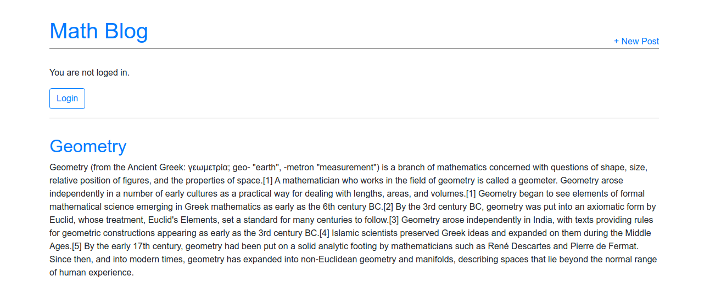

# Blog app

A simple django blog application that allows for creating, reading, updating, deleting & searching posts.

Technologies used:
* ```Python```
* ```Django```
* ```Pipenv```
* ```Git```
* ```HTML```
* ```CSS```
* ```Bootstrap```
* ```Postgresql```
* ```JQuery```
## Installation/ Set up

* Install pipenv using pip: `pip installl pipenv`
* Run virtual environment: `pipenv shell`
* Install all requirements: `pipenv sync`
* Create Postgresql database
* Set up database details in settings.py 
* Run migrations

## App screenshot




<hr>

##### Author:

Marcel Łagoda